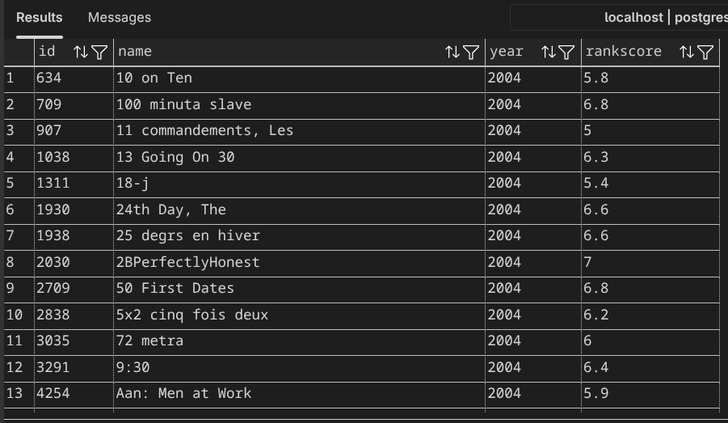
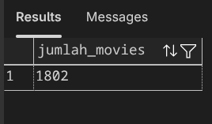
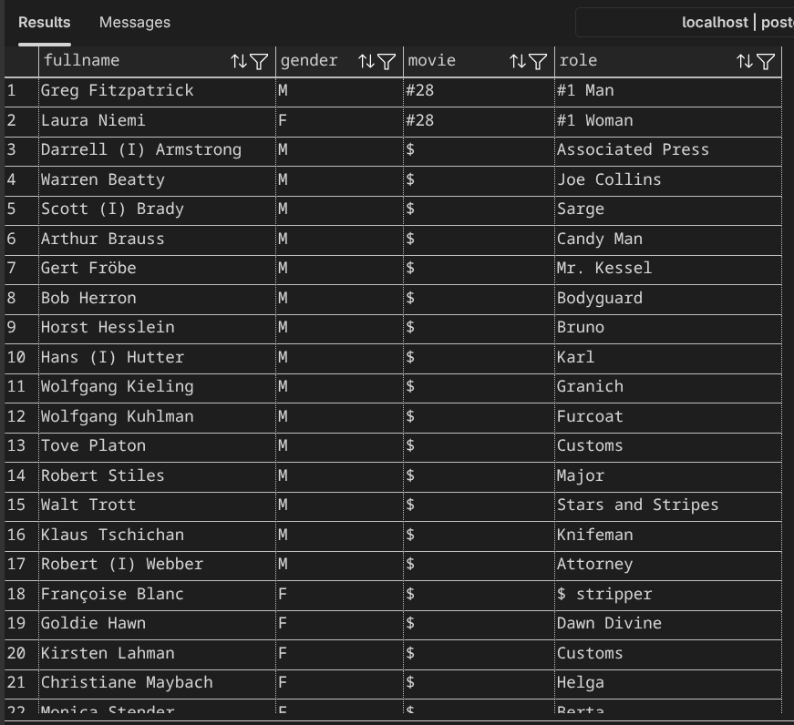
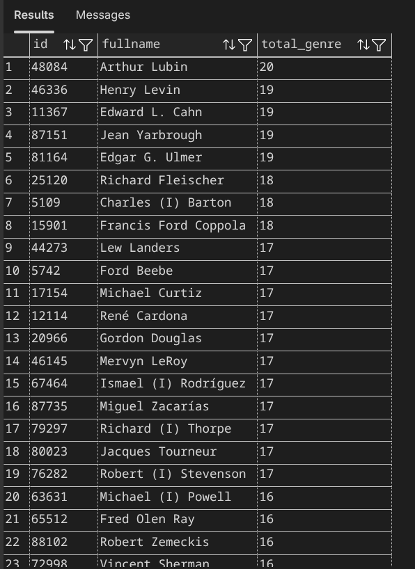
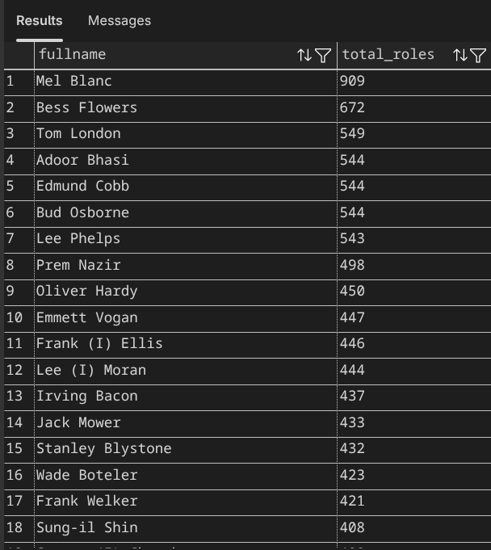
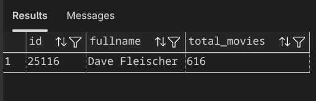
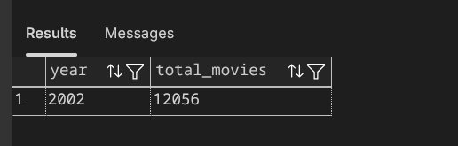
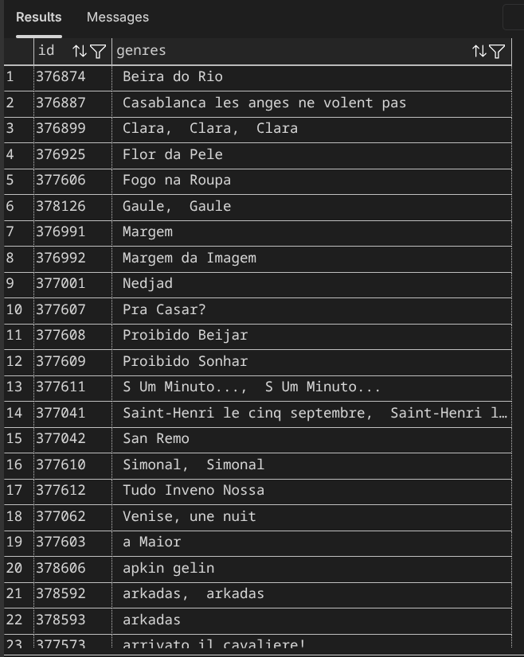

# Database Minitask

## Deskripsi

Repository ini berisi kumpulan query SQL PostgreSQL untuk menyelesaikan beberapa minitask database yang meliputi operasi **SELECT**, **JOIN**, **GROUP BY**, **HAVING**, dan **STRING_AGG**.

## Query 1

### 1. Menampilkan daftar movies
Menampilkan data film berupa ID, nama film, tahun rilis, dan rankscore.

### 2. Menghitung jumlah seluruh movies
Menampilkan total data film yang tersedia pada tabel `movies`.

## Query 2

### 1. Join Directors dan Genres ke Movies
Menampilkan informasi film beserta sutradara dan genre dengan batas 50 data.

### 2. Join Movies dan Roles berdasarkan Actors
Menampilkan nama aktor, gender, judul film, dan peran (role) dengan batas 50 data.

## Query 3

### 1. Director dan jumlah genre yang pernah di-direct
Menghitung jumlah genre yang pernah disutradarai oleh setiap director.

### 2. Actors yang memiliki role lebih dari 5
Menampilkan aktor yang memiliki lebih dari lima peran.

### 3. Director paling produktif
Menampilkan sutradara dengan jumlah film terbanyak.

### 4. Tahun tersibuk
Menampilkan tahun dengan jumlah film terbanyak.

### 5. Movies dengan genre menggunakan `STRING_AGG`
Menggabungkan seluruh genre dari setiap film menjadi satu kolom.

## Screenshots

### Query 1

#### List Movies

#### Total Movies

---

### Query 2

#### Directors, Genres, dan Movies

#### Actors, Roles, dan Movies

---

### Query 3

#### Director dan Total Genre

#### Actors dengan Role > 5

#### Director Paling Produktif

#### Tahun Tersibuk

#### Movies dengan STRING_AGG Genre

## Teknologi

- PostgreSQL
- SQL
