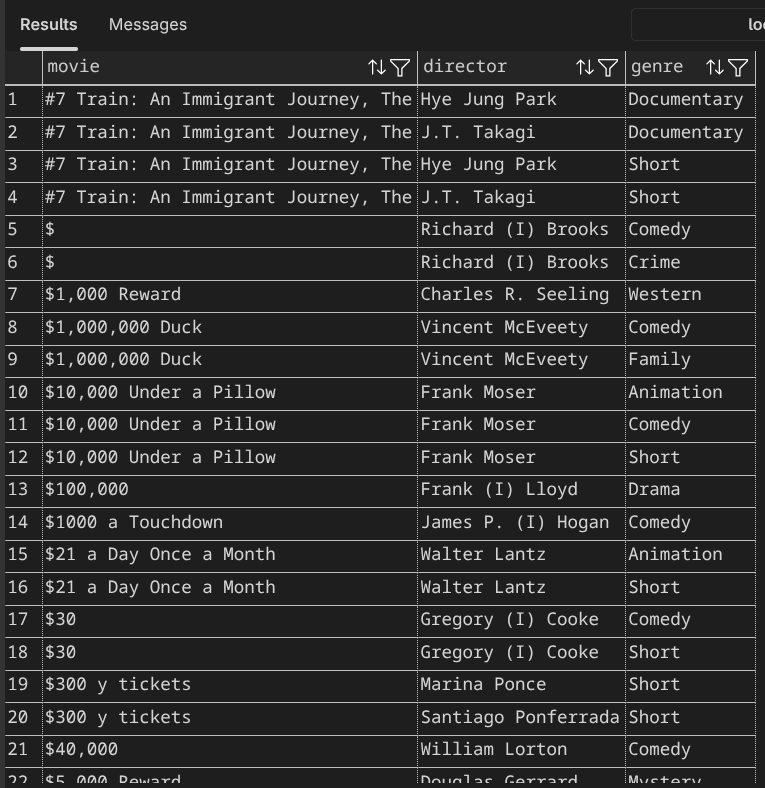

# Database Minitask 2

## Deskripsi
Repository ini berisi query SQL untuk melakukan operasi `JOIN` pada database film menggunakan PostgreSQL.

## Query

### 1. Join Directors dan Genres ke Movies
Menampilkan informasi film beserta sutradara dan genre dengan batas 50 data.

### 2. Join Movies dan Roles berdasarkan Actors
Menampilkan nama aktor, gender, judul film, dan peran (role) dengan batas 50 data.

## Screenshots

### Query 1 Result

### Query 2 Result

## Teknologi

- PostgreSQL
- SQL (JOIN)